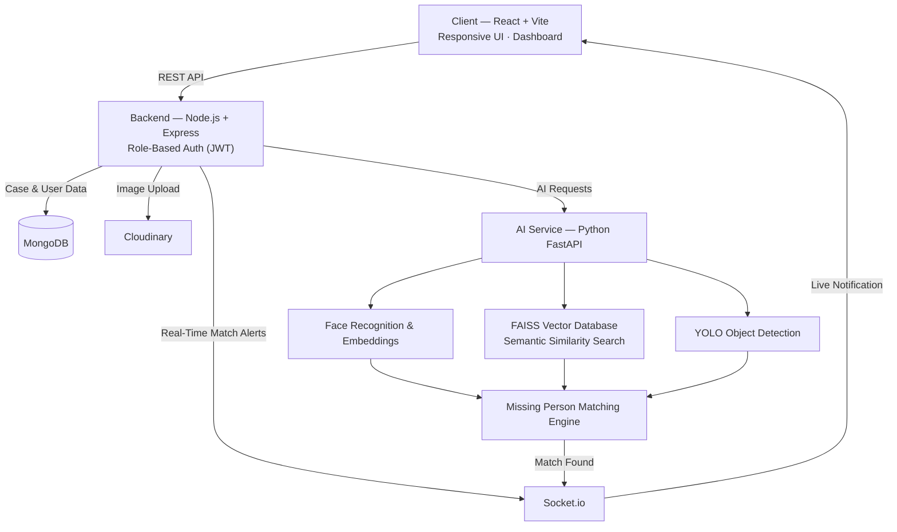
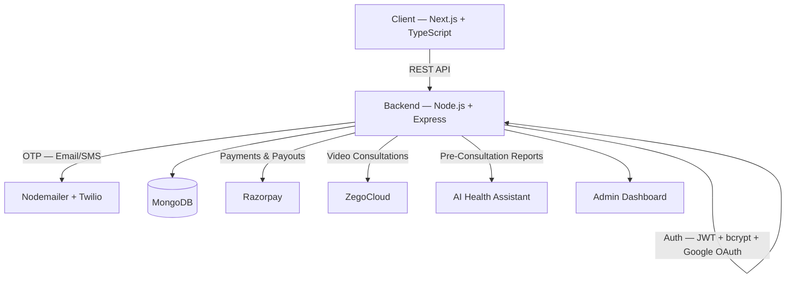
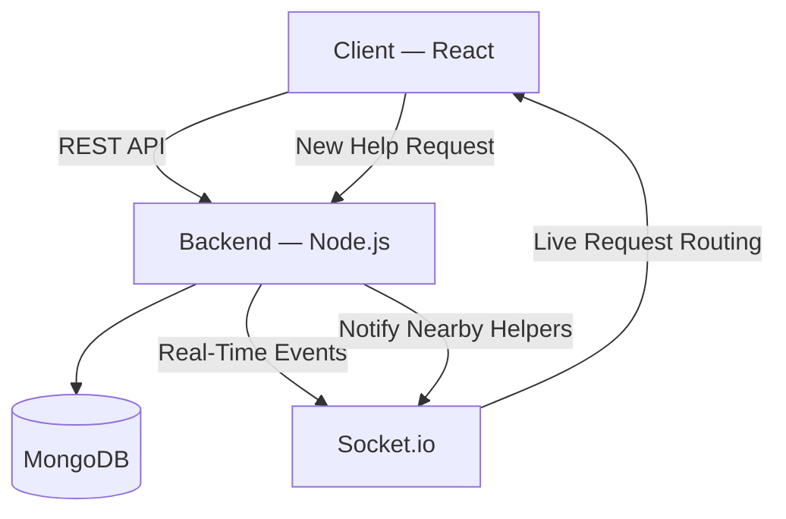
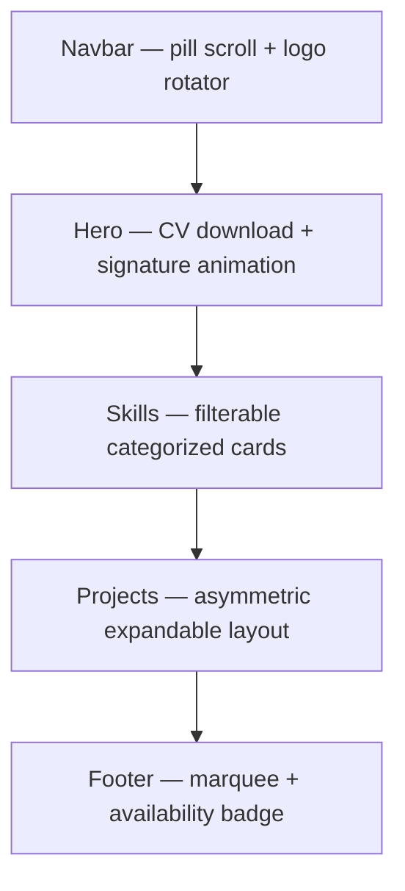

<div align="center">


<br/>

<a href="https://linkedin.com/in/ayush-srivastava-b26a84280">

</a>
<a href="mailto:ayushrivastava0018@gmail.com">

</a>
<a href="https://instagram.com/1_im_ayush">

</a>
<a href="https://github.com/ayush0068">

</a>

<br/><br/>

<a href="https://git.io/typing-svg">

</a>


</div>

<br/>

## INDEX

`01` [About Me](#about-me) &nbsp;·&nbsp; `02` [Tech Stack](#tech-stack) &nbsp;·&nbsp; `03` [Flagship Project — ReConnect-AI](#flagship-project--reconnect-ai) &nbsp;·&nbsp; `04` [Other Projects](#other-projects) &nbsp;·&nbsp; `05` [GitHub Statistics](#github-statistics) &nbsp;·&nbsp; `06` [Activity](#activity-graph) &nbsp;·&nbsp; `07` [Goals & Roadmap](#current-goals) &nbsp;·&nbsp; `08` [Connect](#connect-with-me)

<br/>

## ABOUT ME

I'm a **Full Stack MERN Developer** who builds production-grade web applications end to end — from schema design and secure APIs to responsive, real-time interfaces. My current focus is **integrating AI services into full-stack products**: pairing a Node.js/Express backend with a Python/FastAPI AI layer to ship features that go beyond CRUD — face recognition, semantic search, and vector-based matching.

I care about **clean architecture, secure authentication, and systems that hold up under real usage** — not just demos. Every project below is built with role-based access control, proper error handling, and a deployment-ready structure.

```txt
role        Full Stack MERN Developer
stack       React · Next.js · Node.js · Express · MongoDB · FastAPI
focus       Scalable full-stack applications integrated with AI
flagship    ReConnect-AI — AI-Powered Missing Person Detection Platform
open to     Software Engineer · Full Stack · Backend · AI Engineer roles
```

<br/>

## TECH STACK

<div align="center">

**Frontend**


**Backend**


**Database**


**AI / ML**


**DevOps**


**Tools**


</div>

<br/>

### Skills Breakdown

| Category | Technologies | Applied In |
|---|---|---|
| **Frontend** | JavaScript, TypeScript, React, Vite, Next.js, Tailwind CSS, Redux Toolkit | ReConnect-AI, UniCare+, HelpLink, Portfolio |
| **Backend** | Node.js, Express.js, REST APIs, JWT Authentication, Socket.io | All three platforms — auth, real-time events, secure APIs |
| **Database** | MongoDB, Redis | Case records, user data, session/cache layers |
| **AI / ML** | Python, FastAPI, Face Recognition, Face Embeddings, FAISS, YOLO, Semantic Search | ReConnect-AI's AI microservice |
| **DevOps** | Docker (basic), Git, GitHub | Version control, containerized service boundaries |
| **Tools** | Cloudinary | Image upload & media pipeline across projects |

<br/>

## FLAGSHIP PROJECT — RECONNECT-AI

<div align="center">
<h3>ReConnect-AI</h3>
<i>AI-Powered Missing Person Detection & Community Assistance Platform</i>
</div>

<br/>

ReConnect-AI pairs a standard MERN stack with a dedicated Python AI service to solve a real-world problem: helping communities identify and report missing persons faster, using face recognition and vector similarity search instead of manual matching.

**Core capabilities**

- Face recognition and face embedding generation for uploaded case photos
- Semantic search over case records using a FAISS vector database for fast similarity matching
- YOLO-based object detection to assist in image pre-processing and analysis
- Automated missing-person matching pipeline connecting new reports to existing cases
- Community reporting workflow so users can submit sightings and case updates
- Role-based authentication (JWT) separating admin, verifier, and community access
- Real-time notifications via Socket.io when a potential match is found
- Secure REST APIs connecting the Node.js backend to the FastAPI AI service
- Cloudinary-backed image upload pipeline and a case management dashboard

**Tech stack**

<div align="center">

        

</div>

**System architecture**

<details>
<summary><b>View System Architecture</b></summary>



</details>

<br/>

## OTHER PROJECTS

### UniCare+
**Healthcare Platform** — full-stack online doctor consultation platform.

- Doctor profile verification and admin dashboard
- Appointment booking with double-booking prevention
- Razorpay payment integration and automated doctor payouts
- ZegoCloud video consultations
- AI health assistant generating pre-consultation reports
- Digital prescriptions and OTP-based passwordless login

`Next.js` `TypeScript` `Tailwind CSS` `Node.js` `Express` `MongoDB`

<details>
<summary><b>View System Architecture</b></summary>



</details>

<br/>

### HelpLink
**Community Assistance Platform** — real-time platform connecting people who need help with nearby community members who can respond.

- Real-time request routing between people in need and nearby helpers
- Location-aware matching for faster community response
- Built as a companion system alongside UniCare+

`React` `Node.js` `Socket.io` `MongoDB`

<details>
<summary><b>View System Architecture</b></summary>



</details>

<br/>

### Portfolio
**Personal Portfolio Website** — editorial-styled personal site with custom component animation and interaction design.

- Animated navbar with a pill-shape scroll transformation and a logo text rotator cycling through name, status, and role
- Hero section with a downloadable CV and an SVG signature draw animation
- Filterable, categorized skills section with progress indicators
- Asymmetric projects layout with expandable drawer details
- Footer with a marquee name, hover-fill icons, and an availability badge
- Dark theme with a custom red accent and Playfair Display / DM Sans typography

`React` `Tailwind CSS` `Bootstrap Icons`

<details>
<summary><b>View Component Architecture</b></summary>



</details>

<br/>

### Pinned Repositories

<div align="center">


</div>

<br/>

## GITHUB STATISTICS

<div align="center">


</div>

<br/>

## ACTIVITY GRAPH

<div align="center">

</div>

<br/>

## CONTRIBUTION SNAKE

<div align="center">

</div>

<sub>↳ Generated automatically by the GitHub Action in <code>.github/workflows/snake.yml</code> — runs daily and on every push to <code>main</code>.</sub>

<br/>

## TROPHIES

<div align="center">

</div>

<br/>

## CODING PHILOSOPHY

<div align="center">
<table>
<tr><td align="center" width="100%">
<sub><i>"Code is more than just logic — it's a way to turn ideas into reality."</i></sub>
</td></tr>
</table>
</div>

<br/>

## ENGINEERING PRINCIPLES

```txt
→  Design the schema before the screen
→  Auth and error handling are not optional extras
→  Real-time features should degrade gracefully, not silently fail
→  A service boundary (like FastAPI ↔ Express) should be documented, not guessed
```

<br/>

## FUN FACTS

- Built an AI service and a Node.js backend to talk to each other cleanly across two different languages and runtimes — Python's FastAPI on one side, Express on the other
- Prefers designing the database schema before writing a single UI component
- Debugs by reading logs first, guessing last
- Believes a good README is part of the product, not an afterthought — this one included

<br/>

## CURRENT GOALS

```txt
[ Building ]   Scaling ReConnect-AI's matching pipeline and improving embedding accuracy
[ Refining ]   Authentication, payments, and real-time flows across UniCare+
[ Targeting ]  Software Engineer / Full Stack / Backend / AI Engineer roles
```

<br/>

## OPEN SOURCE GOALS

- Publish reusable modules from ReConnect-AI's FastAPI ↔ Node.js integration layer
- Contribute to open-source projects in the MERN and FastAPI ecosystems
- Document architecture decisions publicly, not just ship code silently

<br/>

## DEPLOYMENT READINESS

```txt
version control     Git + GitHub, feature-branch workflow
containerization     Docker basics — service isolation for the FastAPI AI layer
config management    Environment-based secrets for JWT, DB, and Cloudinary keys
media handling        Cloudinary pipeline for image upload and delivery
```

<br/>

## LEARNING ROADMAP

```txt
current      System design for real-time, AI-integrated backends
deepening    Vector search & retrieval systems (FAISS, embeddings)
exploring    Containerized deployment workflows with Docker
next up      Scalable AI service architecture patterns
```

<br/>

## PROFESSIONAL TRACK

**Foundation** — B.Tech in Computer Science — built the fundamentals in data structures, databases, and web development.

**Full-Stack** — Shipped production-style MERN applications — UniCare+ and HelpLink — with real authentication, payments, and real-time systems.

**AI-Integrated** — Currently building ReConnect-AI, combining a Node.js/Express backend with a Python/FastAPI AI service for face recognition and semantic search.

<br/>

## CONNECT WITH ME

<div align="center">

<a href="https://linkedin.com/in/ayush-srivastava-b26a84280">

</a>
<a href="mailto:ayushrivastava0018@gmail.com">

</a>
<a href="https://instagram.com/1_im_ayush">

</a>
<a href="https://github.com/ayush0068">

</a>

<br/><br/>

**ayushrivastava0018@gmail.com** — open to Software Engineer, Full Stack, MERN, Backend, and AI Engineer roles.

</div>


